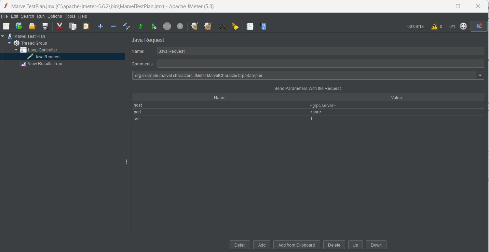
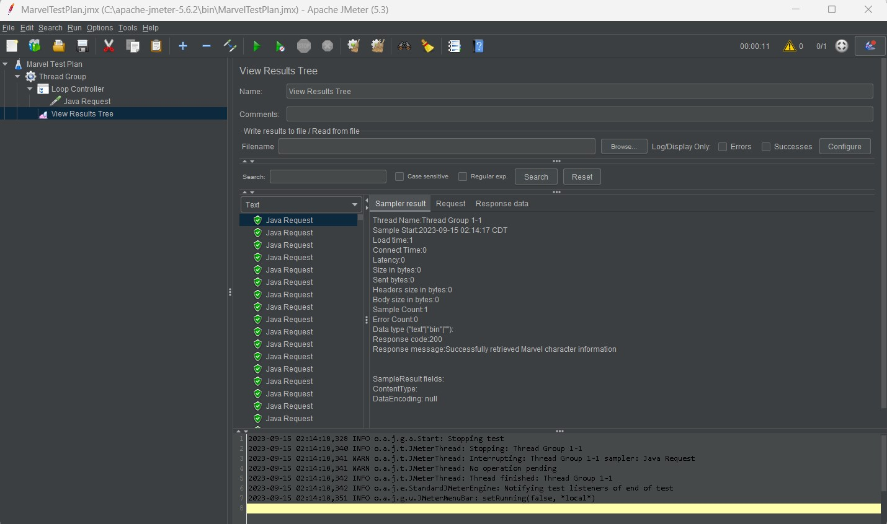

# custom-jmeter-sampler

## Benchmarking gRPC Microservices with Apache JMeter

## Description:

One of the projects I had worked on has many microservices that interacts with each other using gRPC a high-performance cross-platform Remote Procedure Calls.

This Project is the benchmarking these services, the approach we used using Apache JMeter.

## About gRPC:

`gRPC` is a high performance, open-source universal RPC framework, developed by Google. In gRPC, a client application can directly call methods on a server application on a different machine, different platforms as if it was a local object, making it easier to create distributed applications and services.

## About Protocol Buffers:

`Protocol Buffers (protobuf)` is an open-source mechanism developed by Google for serializing structured data used in communication protocols. It serves as the foundation for gRPC communication. In a typical gRPC setup, communication rules between clients and servers are defined in a .proto file. 

## Benchmarking gRPC with Apache JMeter:

`Apache JMeter` is an open-source tool designed for load testing and performance measurement of various services. While JMeter comes with plugins and samplers for testing web services, it lacks direct support for gRPC applications. However, JMeter offers the flexibility to create custom samplers, enabling us to perform load testing on gRPC-based microservices.

Key Steps for Load Testing a gRPC Application using Apache JMeter:

### Step 1: Writing a gRPC Client in Java [pom.xml](POM.xml)

Begin by creating a Maven project and placing the [.proto file](src/main/proto/Marvel.proto) in a source package. To generate data access classes, include the protobuf compiler plugin in the project's pom.xml. These generated classes enable the creation of a Java-based gRPC client, which communicates with the gRPC server.

### Step 2: Writing a Custom JMeter Sampler in Java

Create a custom JMeter sampler, such as [MarvelCharacterGrpcSampler.java](src/main/java/org/example/marvel/characters/JMeter/MarvelCharacterGrpcSampler.java), extending the AbstractJavaSamplerClient class. This custom sampler utilizes the gRPC client to send requests to the server while handling exceptions and collecting response data during the sampling process.

### Step 3: Exporting the Project Jar to JMeter

Export the project as a runnable `JAR` file built from `MAVEN` and place it in JMeter's external libraries folder. This ensures that JMeter can utilize the custom sampler for load testing.

### Step 4: Using the Custom Java Request Sampler in JMeter

With the custom sampler ready, configure a JMeter test plan, specifying test parameters like the number of threads, ramp-up period, and loop count. Define user variables for flexibility. Within the test plan, add a loop controller and configure the custom Java Request sampler to send gRPC requests to the desired host and port.

## Running the Load Test

Once the JMeter test plan is set up, initiate the load test using the JMeter command-line interface (CLI). This begins the load test and generates result files for further analysis.

By following these steps, you can effectively assess the performance of your gRPC-powered microservices, gaining insights into their efficiency and scalability.

### Apache JMeter

        

### Special Note

I assume that a server-side implementation already done according to the .proto demand, This sample project is made for learning purposes only!! Thank you. 
